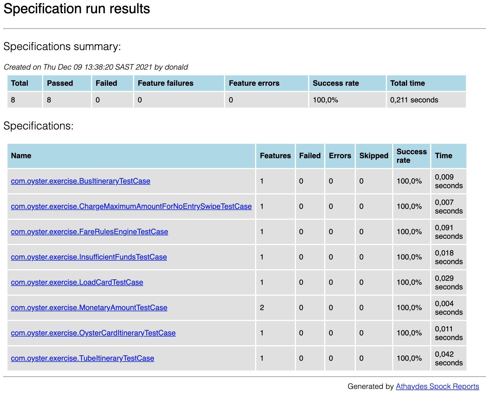
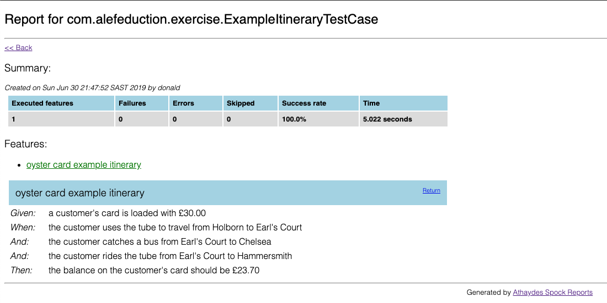

# The Oyster Card Problem

You are required to model the following fare card system which is a limited version of London’s Oyster card system. At the end of the test, you should be able to demonstrate a user loading a card with £30, and taking the following trips, and then viewing the balance.
- Tube Holborn to Earl’s Court
- 328 bus from Earl’s Court to Chelsea
- Tube Earl’s court to Hammersmith

## Operation

When the user passes through the inward barrier at the station, their oyster card is charged the maximum fare.
When they pass out of the barrier at the exit station, the fare is calculated and the maximum fare transaction removed and replaced with the real transaction (in this way, if the user doesn’t swipe out, they are charged the maximum fare).

All bus journeys are charged at the same price.
The system should favour the customer where more than one fare is possible for a given journey. E.g. Holburn to Earl’s Court is charged at £2.50.
For the purposes of this test use the following data:

__Stations and zones:__

| Station        | Zone(s)      |
| :------------- | :----------: |
| Holborn        | 1            |
| Earl's Court   | 1, 2         |
| Wimbledon      | 3            |
| Hammersmith    | 2            |

__Fares:__

| Journey                        | Fare         |
| :----------------------------- | :----------: |
| Anywhere in Zone 1             | £2.50        |
| Any one zone outside zone 1    | £2.00        |
| Any two zones including zone 1 | £3.00        |
| Any two zones excluding zone 1 | £2.25        |
| Any three zones                | £3.20        |
| Any bus journey                | £1.80        |

The maximum possible fare is therefore £3.20.

## Assessment Criteria

Points you will be assessed on:
- Following the Operational requirements
- A working solution which meets the requirements.
- Testing methods and coverage
- Design, Approach and Elegance of Solution.

#

## Execute the build

To run the build, type the following in command line in the project's root directory:
```bash
mvn clean test
```
All the test cases are executed as part of this build.

## Spock Reports
After the build has run, the test reports can be found in _target/spock-reports_. Use a browser to view the _index.html_ file.  
### Specifications Summary Page

### Feature Summary Page
Click on any feature link to view the detail test criteria and test results.

